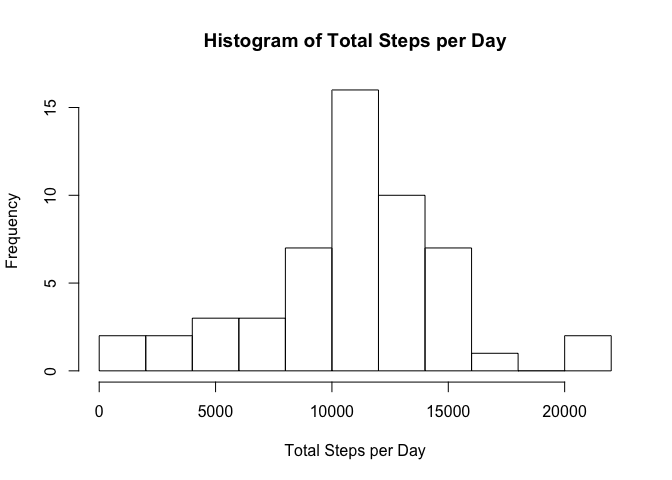
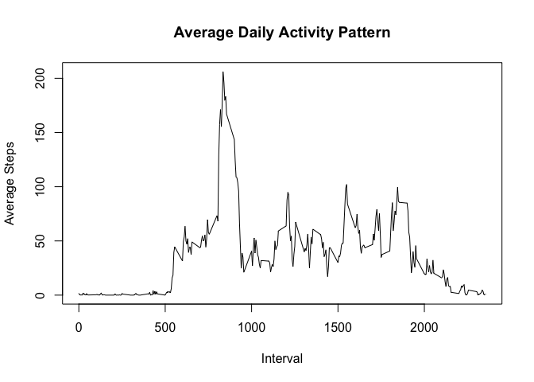
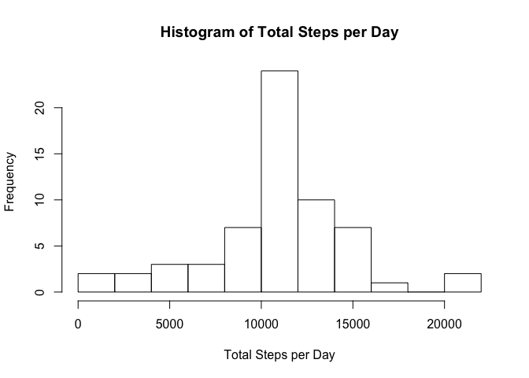
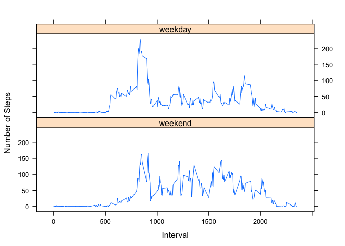

## Loading and preprocessing the data

### 1. Load the data (i.e. `read.csv()`)


```r
unzip("activity.zip")
steps_df <- read.csv("activity.csv")
```

### 2. Process/transform the data (if necessary) into a format suitable for your analysis
Not Needed

## What is mean total number of steps taken per day?

### 1. Make a histogram of the total number of steps taken each day


```r
total_steps_per_day = aggregate(x=steps_df$steps, by=list(steps_df$date), sum)
hist(total_steps_per_day$x, breaks=10, main="Histogram of Total Steps per Day",
     xlab="Total Steps per Day")
```

<!-- -->

### 2. Calculate and report the **mean** and **median** total number of steps taken per day


```r
mean_steps = mean(total_steps_per_day$x, na.rm=TRUE)
print(mean_steps)
```

```
## [1] 10766.19
```

```r
median_steps = median(total_steps_per_day$x, na.rm=TRUE)
print(median_steps)
```

```
## [1] 10765
```

## What is the average daily activity pattern?

### 1. Make a time series plot (i.e. `type = "l"`) of the 5-minute interval (x-axis) and the average number of steps taken, averaged across all days (y-axis)


```r
mean_steps_per_interval = aggregate(x=steps_df$steps, by=list(steps_df$interval),
                                    FUN=mean, na.rm=TRUE, na.action=NULL, drop=FALSE)
plot(mean_steps_per_interval$Group.1, mean_steps_per_interval$x, type = "l",
     main="Average Daily Activity Pattern", ylab="Average Steps", xlab="Interval" )
```

<!-- -->

### 2. Which 5-minute interval, on average across all the days in the dataset, contains the maximum number of steps?


```r
print(mean_steps_per_interval$Group.1[which.max(mean_steps_per_interval$x)])
```

```
## [1] 835
```

## Imputing missing values

### 1. Calculate and report the total number of missing values in the dataset (i.e. the total number of rows with `NA`s)


```r
colSums(is.na(steps_df))
```

```
##    steps     date interval 
##     2304        0        0
```

### 2. Devise a strategy for filling in all of the missing values in the dataset. The strategy does not need to be sophisticated. For example, you could use the mean/median for that day, or the mean for that 5-minute interval, etc.
I will be using the mean for the 5-minute interval to replace the NA values. I believe this should preserve the average daily activity pattern, while perhaps skewing any day to day variations.

### 3. Create a new dataset that is equal to the original dataset but with the missing data filled in.


```r
steps_df_filled <- data.frame(steps_df)
steps_df_filled$steps <- replace(steps_df$steps, which(is.na(steps_df$steps)), mean_steps_per_interval$x)
```

### 4. Make a histogram of the total number of steps taken each day and Calculate and report the **mean** and **median** total number of steps taken per day. Do these values differ from the estimates from the first part of the assignment? What is the impact of imputing missing data on the estimates of the total daily number of steps?


```r
total_steps_per_day_filled = aggregate(x=steps_df_filled$steps, by=list(steps_df_filled$date), sum)
hist(total_steps_per_day_filled$x, breaks=10, main="Histogram of Total Steps per Day",
     xlab="Total Steps per Day")
```

<!-- -->

```r
mean_steps = mean(total_steps_per_day_filled$x, na.rm=TRUE)
print(mean_steps)
```

```
## [1] 10766.19
```

```r
median_steps = median(total_steps_per_day_filled$x, na.rm=TRUE)
print(median_steps)
```

```
## [1] 10766.19
```

The values for mean steps per day remained the same at 10766.19. However, since the filled in data set now actually includes the mean, the new median actually matches the mean.

## Are there differences in activity patterns between weekdays and weekends?

### 1. Create a new factor variable in the dataset with two levels -- "weekday" and "weekend" indicating whether a given date is a weekday or weekend day.


```r
weekday_names <- c('Monday', 'Tuesday', 'Wednesday', 'Thursday', 'Friday')
steps_df_filled$f_daytype <- factor((weekdays(as.Date(steps_df_filled$date, '%Y-%m-%d')) %in% weekday_names),
                                    levels=c(FALSE, TRUE), labels=c('weekend', 'weekday'))
```

### 1. Make a panel plot containing a time series plot (i.e. `type = "l"`) of the 5-minute interval (x-axis) and the average number of steps taken, averaged across all weekday days or weekend days (y-axis). The plot should look something like the following, which was created using **simulated data**:


```r
mean_steps_per_interval = aggregate(steps_df_filled$steps,
                                    list(steps_df_filled$interval, steps_df_filled$f_daytype),
                                    FUN=mean, na.rm=TRUE, na.action=NULL, drop=FALSE)


names(mean_steps_per_interval)[1] <- "interval"
names(mean_steps_per_interval)[2] <- "f_daytype"
names(mean_steps_per_interval)[3] <- "steps"

library(lattice)
xyplot(steps ~ interval | f_daytype,
       data = mean_steps_per_interval,
       type="l", layout = c(1, 2),
       xlab="Interval", ylab="Number of Steps")
```

<!-- -->

The plots show that the weekend activity pattern does not have the early morning peak seen in the weekdays, and is somewhat more active and evenly distributed throughout the rest of the day.
